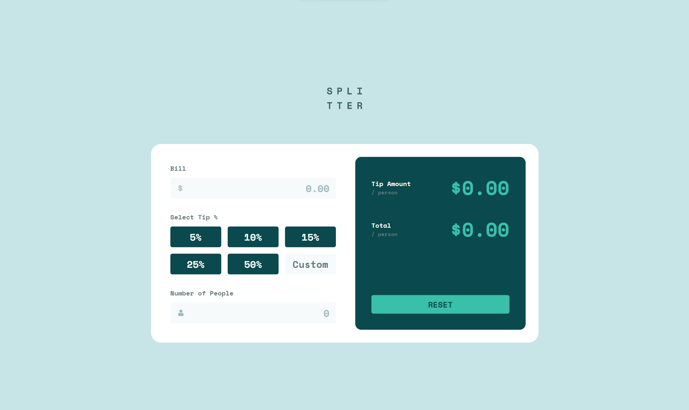

# Frontend Mentor - Tip Calculator App Solution

## Table of contents
- [Installation](#installation)
- [Overview](#overview)
  - [Introduction](#introduction)
  - [Screenshot](#screenshot)
  - [Links](#links)
- [My process](#my-process)
  - [Challenges](#challenges)
  - [Built with](#built-with)
  - [Code Highlights](#code-highlights)
- [Author](#author)

## Installation
Clone the repo to your local computer:
```
git clone https://github.com/weebao/tip-calculator-app-main.git
```
Install all the necessary packages and modules
```
npm install
```
To run the web app on a locally hosted website:
```
npm start
```
Enjoy!

## Overview

### Introduction
This is my second React app which is a bill calculator that calculates the amount a person pay including the tip.

### Screenshot



### Links

- Solution URL: [Frontend Mentor](https://www.frontendmentor.io/solutions/more-react-hooks-better-file-organization-better-scss-use-learned-lzyA4KOua9)
- Live Site URL: [Tip Calculator](https://tip-calculator-app-main-pied.vercel.app/)

## My process
- I always started with styling first but this time I focused on making sure the components work properly before adding any styling.
- I started with adding components, then looked up different React Hooks and learned their basics.
- Since there are so many components, it becomes confusing, so I started looking up different file structures for web developing.
- After a week, I had all the components working properly so I moved on with styling.
- Surprisingly, styling everything took me more than a week since there are different indicators to consider and also because I wanted to add some more features.
- After making sure the app work properly and look close to the original design, I used Vercel for the first time to deploy my app.

### Challenges
- My first challenge is seeing the limits of useState. After messing around with useState, I realized it will not work well since there are a lot of elements to consider and manage in a state. This was when I first learned about useReducer and also a bit of Redux, which helped me organize my React app a lot better since I can manage different cases and elements independently in one state.
- My second challenges comes with one of the features I wanted to add in, where the bill form will format the input amount when it is out of focus. I came across the Intl.NumberFormat function of JavaScript which worked wonders.
- My third challenge, which took me the longest time to work on, was the error indicator for the bill and people form. I wanted to have it show specifically how the input is invalid as in whether it is zero or negative. One problem occurred to me that I cannot seem to change the border color directly in JavaScript, which I struggled for a while until I realized a simple solution is just to add an error class and format it in SCSS.

### Built with

- [React](https://reactjs.org/) - JS library
- SCSS
- Flexbox and Grid

### Code Highlights

This is one of the coolest features I added, which is that the tip percent button will light up if the input in custom field coordinates with one of the percent listed. It is quite simple to make but I personally think it is pretty cool.

```html
<div>
      <div className="label">Select Tip %</div>
      <div className="tip-percent" onChange={handleTip} >
        <input id="tip5" type="radio" checked={tip == 5} name="5" value="5" />
        <label for="tip5">5%</label>
        <input id="tip10" type="radio" checked={tip == 10} name="10" value="10" />
        <label for="tip10">10%</label>
        <input id="tip15" type="radio" checked={tip == 15} name="15" value="15" />
        <label for="tip15">15%</label>
        <input id="tip25" type="radio" checked={tip == 25} name="25" value="25" />
        <label for="tip25">25%</label>
        <input id="tip50" type="radio" checked={tip == 50} name="50" value="50" />
        <label for="tip50">50%</label>
        <span>
          <input type="number" className="input-form hide-spin" name="custom-tip" placeholder="Custom" ref={inputRef}/>
        </span>
      </div>
    </div>
```

## Author

- GitHub - [Bao Dang](https://github.com/weebao)
- Frontend Mentor - [@Bao Dang](https://www.frontendmentor.io/profile/weebao)
